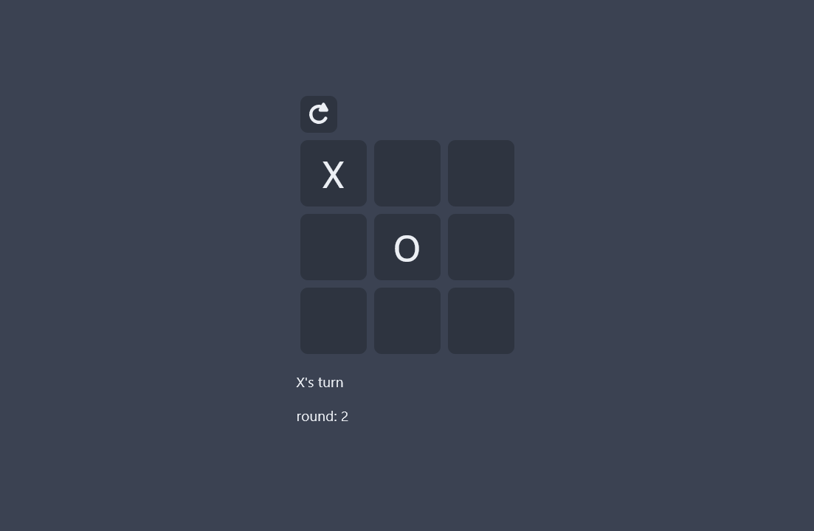

# tictactoe-react

Tictactoe created using React

## Screenshot




## Usage

### Install dependencies
```
npm install
```

### Run React dev server (http://localhost:3000)
```
npm start
```

### Build for production
```
npm run build
```

## TODO
* Add option to add more squares
* Add multiplayer